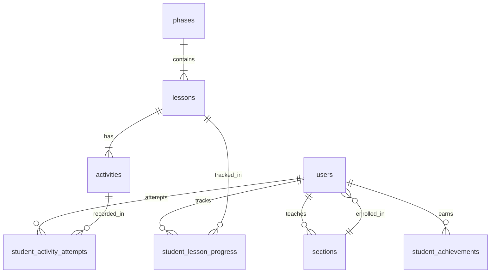

# FiliUp - Filipino Learning Platform Backend

## Overview
Backend implementation for FiliUp, an interactive Filipino language learning platform with multi-role support, progressive learning system, and comprehensive activity tracking.

## Core Features

### User Management
- Multi-role system (Admin, Teacher, Student)
- JWT-based authentication
- Section-based organization for students
- Invitation code system for section enrollment

### Learning System
- Progressive phase/lesson unlocking
- 4 interactive activity types
- Real-time progress tracking
- Achievement system
- Leaderboards

## Database Schema

### Entity Relationships




### Tables

#### users
```sql
CREATE TABLE users (
    id UUID PRIMARY KEY DEFAULT uuid_generate_v4(),
    email VARCHAR(255) UNIQUE NOT NULL,
    password_hash VARCHAR(255) NOT NULL,
    full_name VARCHAR(255) NOT NULL,
    role VARCHAR(20) NOT NULL CHECK (role IN ('ADMIN', 'TEACHER', 'STUDENT')),
    section_id UUID REFERENCES sections(id),
    is_active BOOLEAN DEFAULT true,
    created_at TIMESTAMP DEFAULT CURRENT_TIMESTAMP,
    updated_at TIMESTAMP DEFAULT CURRENT_TIMESTAMP
);
```

#### sections
```sql
CREATE TABLE sections (
    id UUID PRIMARY KEY DEFAULT uuid_generate_v4(),
    name VARCHAR(255) NOT NULL,
    grade_level VARCHAR(50),
    teacher_id UUID REFERENCES users(id),
    invite_code VARCHAR(20) UNIQUE NOT NULL,
    capacity INTEGER DEFAULT 30,
    is_active BOOLEAN DEFAULT true,
    created_at TIMESTAMP DEFAULT CURRENT_TIMESTAMP,
    updated_at TIMESTAMP DEFAULT CURRENT_TIMESTAMP
);
```

[View complete schema in SCHEMA.md](./docs/SCHEMA.md)

## API Endpoints

### Authentication
| Method | Endpoint | Description |
|--------|----------|-------------|
| POST | `/api/auth/login` | Login with credentials |
| POST | `/api/auth/register` | Register new user |
| POST | `/api/auth/refresh` | Refresh JWT token |
| GET | `/api/auth/me` | Get current user profile |

### Admin Routes
| Method | Endpoint | Description |
|--------|----------|-------------|
| GET | `/api/admin/stats` | System statistics |
| GET | `/api/admin/users` | List all users |
| POST | `/api/admin/users` | Create user |
| PUT | `/api/admin/users/{id}` | Update user |
| GET | `/api/admin/logs` | Activity logs |

### Teacher Routes
| Method | Endpoint | Description |
|--------|----------|-------------|
| GET | `/api/teacher/sections` | List teacher's sections |
| POST | `/api/teacher/sections` | Create section |
| GET | `/api/teacher/sections/{id}` | Section details |
| GET | `/api/teacher/sections/{id}/students` | Section students |
| GET | `/api/teacher/sections/{id}/leaderboard` | Section leaderboard |

### Student Routes
| Method | Endpoint | Description |
|--------|----------|-------------|
| POST | `/api/student/register-section` | Join section |
| GET | `/api/student/profile` | Student profile |
| GET | `/api/student/lessons` | List lessons |
| POST | `/api/student/activities/{id}/submit` | Submit activity |
| GET | `/api/student/leaderboard` | View leaderboard |

[View complete API documentation](./docs/API.md)

## Security

### JWT Configuration
```properties
jwt.secret=${JWT_SECRET:your-secret-key-change-in-production}
jwt.expiration=86400000  # 24 hours
jwt.refresh.expiration=604800000  # 7 days
```

### Authentication Flow
1. Client submits credentials
2. Server validates and issues JWT
3. Client includes JWT in Authorization header
4. Server validates JWT for protected routes
5. Role-based access control enforced

## Development Setup

### Prerequisites
- Java 17+
- PostgreSQL 14+
- Maven 3.8+

### Configuration
1. Create database
```sql
CREATE DATABASE filiup;
```

2. Configure application.properties
```properties
spring.datasource.url=jdbc:postgresql://localhost:5432/filiup
spring.datasource.username=your_username
spring.datasource.password=your_password
```

3. Run migrations
```bash
./mvnw flyway:migrate
```

### Running Tests
```bash
./mvnw test
```

### Development Server
```bash
./mvnw spring-boot:run
```

## Data Seeding

### Demo Accounts
- Admin: `admin@filipino.edu` / `admin123`
- Teacher: `teacher@filipino.edu` / `teacher123`
- Student: `student1@filipino.edu` / `student123`

### Sample Content
- 2 Phases
- 4 Lessons
- 16 Activities
- 3 Sections
- 10 Students

Run seeder:
```bash
./mvnw spring-boot:run -Dspring-boot.run.profiles=seed
```

## License
MIT License - see [LICENSE](LICENSE) for details
